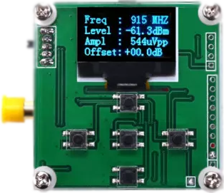
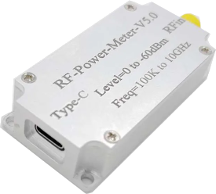

[</img>](https://github.com/coozoo/qtrfpowermeter/releases/latest)
[</img>](https://copr.fedorainfracloud.org/coprs/yura/qtrfpowermeter/)

# QT RF Power Meter
This application few hours project (not anymore now add week to that) intended to improve usage of Chinese RF power meters. The default applications are often terrible and unreliable, with no functionality and lot of crashes.

## Supported Devices

### RF8000
This is the original device the application was built for. There are versions of this device with lower frequency ranges, and while they may be compatible, the only limitation might be the ability to set higher frequencies in the software.



*   **Protocol:** Simple serial protocol that reports dbm and Vpp values.
*   **Issues:** Can have bugs with broken characters which can often be fixed by setting the frequency and offset within the program. If you see no captures and broken symbols on the device screen, try setting the frequency using the program.
*   **Identification:** The application cannot automatically identify this device. If you have multiple serial devices connected, you must select the correct one manually.

### RF Power Meter v5
A newer version of the device with a pretty similar protocol logic (a bit extended) but different formats.



*   **Protocol:** Similar to the RF8000 but different enough.
*   **Identification:** The application attempts to identify this device at least to say that it's not the one what you connected for.


## Features

To initiate connection press connect. After that raw data captured from device will be in log tab.

On data tab there is parsed and calculated data exactly in the same way it's written to csv if such option selected on status tab.

Status tab contains displays with on-fly data and box with possibility to set device offset and frequency, there is chart with possibility to save images.

Supports adding fixed and digital attenuators of one kind https://github.com/coozoo/digiattcontrol. So in such way the range of measurement is now defined only by attenuators that you have available. Also you can set cables type and length in order to count them in total attenuation.

For convenient measurement there is attenuation calculator to prevent mixing and damaging your equipment but still you need to be cautious.

There is calibration possibility that can be done manually, by selecting level frequency and pressing button, sure you need to set your generator exactly such parameters


## Installation

Precompiled RPMs (Fedora,RHEL etc) can be found in COPR click below:

[</img>](https://copr.fedorainfracloud.org/coprs/yura/qtrfpowermeter/)

```
$ sudo dnf copr enable yura/qtrfpowermeter
$ sudo dnf install qtrfpowermeter
```

You can get precompiled package for other OS here:

https://github.com/coozoo/qtrfpowermeter/releases

[</img>](https://github.com/coozoo/qtrfpowermeter/releases/latest)

There is deb repo on launchpad, use next commands to install it

```
sudo add-apt-repository ppa:coozoo/qtrfpowermeter
sudo apt update
sudo apt-get install qtrfpowermeter
```

Mac users

Should dance and turn few times in order to launch it. Once app unpacked you need to allow it  for damn mac security and it's getting harder from day to day

```
# adjust application location accordingly to yours
xattr -dr com.apple.quarantine /Applications/qtjsondiff.app
codesign --force --deep --sign - /Applications/qtjsondiff.app
```

If you still need to build it by your own.

It is required qt6 so adjust qmake accordingly to your system.

```
qmake6
make -j$(nproc)
```


### Supported Build Tags

You can trigger or control specific build jobs by including one or more of these tags in your commit message or pull request title/body:

| Tag                 | Effect                                                       |
|---------------------|--------------------------------------------------------------|
| `[build mac dmg]`   | Builds a macOS DMG package                                   |
| `[build mac zip]`   | Builds a macOS ZIP package                                   |
| `[build mac]`       | Builds a macOS DMG package (alias for `[build mac dmg]`)     |
| `[build win]`       | Builds the Windows release                                   |
| `[build linux]`     | Builds the Linux release                                     |
| `[skip ci]`         | Skips all CI jobs for this commit or PR                      |

**Note:**  
If no build tags are present, the system will build **all platforms** by default.  
Use `[skip ci]` to intentionally skip the build and workflow runs.


