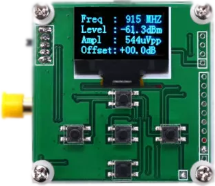
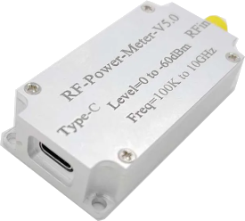
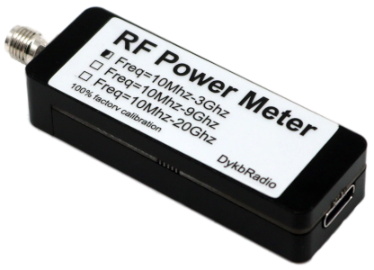

[</img>](https://github.com/coozoo/qtrfpowermeter/releases/latest)
[</img>](https://copr.fedorainfracloud.org/coprs/yura/qtrfpowermeter/)

# QT RF Power Meter
This application few hours project (not anymore now add week to that) intended to improve usage of Chinese RF power meters. The default applications are often terrible and unreliable, with no functionality and lot of crashes.

## Supported Devices

### RF8000
This is the original device the application was built for. There are versions of this device with lower frequency ranges, and while they may be compatible, the only limitation might be the ability to set higher frequencies in the software.



*   **Protocol:** Simple serial protocol that reports dbm and Vpp values.
*   **Issues:** Can have bugs with broken characters which can often be fixed by setting the frequency and offset within the program. If you see no captures and broken symbols on the device screen, try setting the frequency using the program.
*   **Identification:** The application cannot automatically identify this device. If you have multiple serial devices connected, you must select the correct one manually.

### RF Power Meter v5
A newer version of the device with a pretty similar protocol logic (a bit extended) but different formats.



*   **Protocol:** Similar to the RF8000 but different enough.
*   **Identification:** The application attempts to identify this device at least to say that it's not the one what you connected for.

### ConceptRF RPM family (RPM-20GS / RPM-9G / RPM-6GH / RPM-3GS)
A USB RF power meter that is genuinely well built - the unit ships with an excellent factory calibration burned into non-volatile memory on the device itself, so no manual calibration is needed in normal use. The same driver handles all four models; the specific one is auto-detected at connect.



| Model     | Frequency       | Power            | Sensor   |
|-----------|-----------------|------------------|----------|
| RPM-3GS   | 50 Hz - 3 GHz   | -50 … +10 dBm    | AD8362   |
| RPM-9G    | 10 MHz - 9 GHz  | -40 … +10 dBm    | ARW22347 |
| RPM-6GH   | 10 MHz - 6 GHz  | -80 … +20 dBm    | ARW22283 |
| RPM-20GS  | 10 MHz - 20 GHz | -40 … +10 dBm    | ARW28340 |

*   **Protocol:** Binary, 460 800 baud. Frames are `0x55 0xAA <cmd> <len> <~len> <data…> <checksum>`. Full specification lives in [`docs/protocol/rpm-series.md`](../docs/protocol/rpm-series.md).
*   **Identification:** The device reports its model id, firmware version and serial number at connect; the status bar shows them as e.g. `RPM-20GS | fw 1.10 | S/N 52852392`. Sample rate is reset to 10 Hz on every connect to match the reference Windows app's behaviour and is changeable while live (10 / 40 / 640 / 1280 Hz). The host downloads the full per-frequency calibration table from the device and applies bilinear interpolation to recover dBm from the raw ADC readings.
*   **USB ID collision:** All four models share the CH340 USB ID `0x1a86:0x7523` with the RF8000 family. The first time you pick a device type for a given port, the application remembers your choice; subsequent plug-ins of the same VID:PID auto-select what you used last time. If you see "No identify response — not a compatible Concept RF RPM" in the status line, the device on that port is probably an RF8000 — switch the device type and retry.
*   **Fast view:** A "Fast view…" button at the bottom of the main window opens a rolling oscilloscope-style chart that plots every raw sample at uniform sample-domain spacing (the same way the reference app draws). Adjustable window length, left/right flow direction, auto/manual Y-scale, pause, and silent save-to-PNG / save-to-CSV with min/max/avg.

## Features

To initiate connection press connect. After that raw data captured from device will be in log tab.

On data tab there is parsed and calculated data exactly in the same way it's written to csv if such option selected on status tab.

Status tab contains displays with on-fly data and box with possibility to set device offset and frequency, there is chart with possibility to save images.

Supports adding fixed and digital attenuators of one kind https://github.com/coozoo/digiattcontrol. So in such way the range of measurement is now defined only by attenuators that you have available. Also you can set cables type and length in order to count them in total attenuation.

For convenient measurement there is attenuation calculator to prevent mixing and damaging your equipment but still you need to be cautious.

### Calibration

There are three calibration modes plus a built-in viewer for devices that ship their own factory table.

**Simple (manual).** The original mode. Generate a list of frequencies in the table, pick a row, set your reference generator to that row's frequency at the reference power (RefPower spin box), click *Calibrate Selected*. The stored correction is `refPower - measured average`, and the runtime apply path uses a spline across all populated rows. Quick to set up, one correction value per frequency.

**Advanced (2D table).** Same idea but the correction is stored per `(frequency, power level)` cell rather than just per frequency. When you click a cell in the grid the RefPower spin box snaps to the cell's column level and the meter is retuned to the row's frequency, so *Calibrate Selected* targets exactly that point. The runtime apply path is bilinear interpolation on `(frequency, measured dBm)`. It captures generator behaviour that varies with level, not just frequency, but it's a much longer manual process — a 21-column power axis means each row has 21 cells to fill.

**Auto via TinySa.** With a [TinySa](https://www.tinysa.org/) (or TinySa Ultra) plugged into a second USB port and its RF OUT cabled to the meter input, check the *Auto* box and connect the TinySa from the calibration panel. *Calibrate Selected* then drives the TinySa to the target freq/level itself, waits for the signal to settle, samples, and stores. *Calibrate All* sweeps every row in Simple or every `(row, column)` cell in Advanced; the same button toggles to *Cancel calibration* while running so you can abort. Cells the TinySa cannot reach at a given frequency are clamped to the achievable band (max minus 5 dB) and the same clamped value goes into the correction formula, so the meter and the formula agree on what was actually driven. The DUT is tuned for each cell, and calibrated cells in the Advanced grid turn green so you can see progress at a glance.

**ConceptRF factory calibration view.** When a ConceptRF device is connected, the calibration panel locks to *Disabled* and shows the read-only factory table the device sent on connect (model / firmware / serial, the full frequency × power voltage grid, a per-frequency plot, CSV export). Factory calibration is applied internally by the device, so user calibration stays out of the way — no double correction.


## Installation

Precompiled RPMs (Fedora,RHEL etc) can be found in COPR click below:

[</img>](https://copr.fedorainfracloud.org/coprs/yura/qtrfpowermeter/)

```
$ sudo dnf copr enable yura/qtrfpowermeter
$ sudo dnf install qtrfpowermeter
```

You can get precompiled package for other OS here:

https://github.com/coozoo/qtrfpowermeter/releases

[</img>](https://github.com/coozoo/qtrfpowermeter/releases/latest)

There is deb repo on launchpad, use next commands to install it

```
sudo add-apt-repository ppa:coozoo/qtrfpowermeter
sudo apt update
sudo apt-get install qtrfpowermeter
```

Mac users

Should dance and turn few times in order to launch it. Once app unpacked you need to allow it  for damn mac security and it's getting harder from day to day

```
# adjust application location accordingly to yours
xattr -dr com.apple.quarantine /Applications/qtjsondiff.app
codesign --force --deep --sign - /Applications/qtjsondiff.app
```

If you still need to build it by your own.

It is required qt6 so adjust qmake accordingly to your system.

```
qmake6
make -j$(nproc)
```


### Supported Build Tags

You can trigger or control specific build jobs by including one or more of these tags in your commit message or pull request title/body:

| Tag                 | Effect                                                       |
|---------------------|--------------------------------------------------------------|
| `[build mac dmg]`   | Builds a macOS DMG package                                   |
| `[build mac zip]`   | Builds a macOS ZIP package                                   |
| `[build mac]`       | Builds a macOS DMG package (alias for `[build mac dmg]`)     |
| `[build win]`       | Builds the Windows release                                   |
| `[build linux]`     | Builds the Linux release                                     |
| `[skip ci]`         | Skips all CI jobs for this commit or PR                      |

**Note:**  
If no build tags are present, the system will build **all platforms** by default.  
Use `[skip ci]` to intentionally skip the build and workflow runs.


